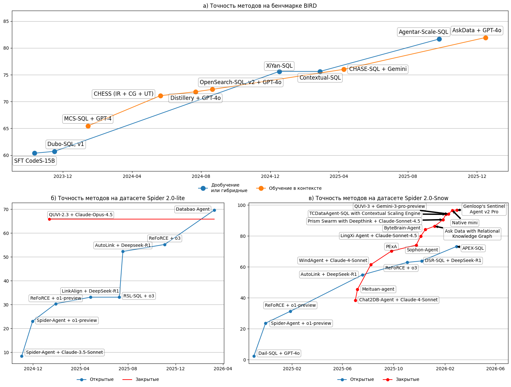

# Исследование методов text-to-SQL

За последние годы задача text-to-SQL получила значимое развитие благодаря использованию LLM и in-context learning техник, что позволило достичь большого прогресса на актуальных бенчмарках, таких как BIRD и Spider 2.0.

Данное исследование направлено на изучение существующих методологий и определения баланса между точностью и затратами в архитектурных решениях.

_График изменения точности топ-1 метода на бенчмарках BIRD и Spider 2.0._

## Анализ методов text-to-SQL

Для оценки используется бенчмарк [Spider 2.0](https://github.com/xlang-ai/Spider2) (преимущественно датасет Spider 2.0-lite).

_Рекомендации по разработке text-to-SQL систем_

| **Модуль**                         | **Тип реализации** | **Лучшие практики**                                                                           | **Влияние**                                                                                                                                  | **Источник**                                                                      |
| ---------------------------------- | ------------------ | --------------------------------------------------------------------------------------------- | -------------------------------------------------------------------------------------------------------------------------------------------- | --------------------------------------------------------------------------------- |
| Связывание схемы                   | Традиционная       | Генерация эмбеддингов описаний схемы и векторный поиск.                                       | Генерация: +11.71 секунд (векторный поиск). Предобработка: +338 секунд (генерация эмбеддингов).                                     | Таб. 18, на Spider 2.0-lite.                                                   |
|                                    |                    | Сжатие схемы по паттернам.                                                                    | До 96% сокращение описания схемы.                                                                                                            | \[56, с. 3-5\], на Spider 2.0-lite.                                            |
|                                    | Статичная          | Двунаправленное связывание схемы.                                                             | +5.41% EX. Генерация: +2.6 секунды; +10500 токенов.                                                                                 | \[89, с. 4522\], для GPT-4o-mini на BIRD dev.                               |
|                                    |                    | На основе SQL.                                                                                | 90.48% SRR; 95.54% Recall. Генерация: +5310 токенов.                                                                                | \[85, с. 8\], для GPT-4o на BIRD dev.                                       |
|                                    |                    | Графовое представление.                                                                       | +6.38% EX; 95.71% Recall.                                                                                                                 | \[91, с. 2590\], для GPT-5-mini на BIRD dev.                                |
|                                    | Агентная           | Агент с доступом к векторной базе данных.                                                     | Генерация: +11.71 секунд (векторный поиск); +871 секунд; +162747 токенов. Предобработка: +338 секунд (генерация эмбеддингов). | Таб. 18, для Hy 3 preview на Spider 2.0-lite.                               |
| Переписывание вопроса              | Статичная          | Вопрос дополняется информацией из внешних знаний, выделяются заданные ограничения.            | +7.7% EX. Генерация: +3.25 секунд; +1683 токенов.                                                                                   | \[92, с. 11\], для Gemini-3-Pro       на Spider 2.0-snow.                      |
|                                    | Агентная           | Агент переписывает и уточняет вопрос из результатов связывания схемы.                         | +17.1% EM; +7.7% Recall (связывание схемы). Генерация: +30.9 секунд.                                                             | \[86, с. 984\], для DeepSeek-R1 на Spider.                                  |
| Извлечение содержимого базы данных | Традиционная       | Хэш индексы уникальных значений.                                                              | +2.92% EX. Генерация: +5 секунд.                                                                                                       | \[53, с. 11\], \[51, с. 14\] для Gemini 1.5 на BIRD dev.                    |
|                                    | Статичная          | Автоматическое профилирование данных.                                                         | +2.80% EX. Предобработка: +3700 секунд; +22000 токенов (выходных).                                                                  | \[90, с. 9\], для GPT-4o на BIRD dev.                                       |
|                                    |                    | Генерация исследовательских запросов.                                                         | + 0.73% EX. Генерация: +111 секунд; +554 секунды (исправление); +959818 токенов.                                                 | Таб. 15, 4.4, c. 84, для Step 3.5 Flash на Spider 2.0-lite.                    |
|                                    | Агентная           | Использование генерации исследовательских запросов как инструмент агента.                     | +2.4% SRR (связывание схемы). Генерация: +112 секунд.                                                                                  | \[57, с. 6\], рис. 25, для DeepSeek-R1, Hy 3 preview на Spider 2.0-lite.    |
| Внедрение внешних знаний           | Традиционная       | Маскирование вопросов, генерация эмбеддингов, векторный поиск релевантных примеров генерации. | +10.1% EX. Генерация: 600 токенов.                                                                                                     | \[63, с. 8\], для GPT-4 на Spider dev.                                      |
|                                    | Статичная          | Генерация рассуждений для примеров вопрос/SQL.                                                | +1.4% EX.                                                                                                                                    | \[52, с. 18\], для GPT-4o на BIRD dev.                                      |
| Декомпозиция                       | Статичная          | Декомпозиция вопроса и объединение промежуточных SQL.                                         | +1.24% EX.                                                                                                                                   | \[53, с. 11\], для Gemini 1.5 на BIRD dev.                                  |
|                                    | Агентная           | Агент планировщик.                                                                            | +5.39% EX. Генерация: +6.50 секунд; +5428 токенов.                                                                                  | \[92, с. 11-12\], для Gemini-3-Pro на Spider 2.0-snow.                      |
|                                    |                    | Разделение схемы на части, вызов агента для каждой, объединение.                              | +7.13% EX. Генерация: +46.28 секунд; +71024 токенов.                                                                                | \[92, с. 11-12\], для Gemini-3-Pro на Spider 2.0-snow.                      |
| Исправление                        | Статичная          | Исправление на основе результата исполнения.                                                  | +7.87% EX. Генерация: +262 секунд; +14700 токенов.                                                                                  | \[57, с. 17\], таб. 18, для DeepSeek-R1, Step 3.5 Flash на Spider 2,0-lite. |
|                                    |                    | Добавление вручную составленных правил и семантическое исправление.                           | +0.98 EX. Генерация: +8 секунд; +700 токенов (выходных).                                                                            | \[90, с. 9\], для GPT-4o на BIRD dev.                                       |
|                                    | Агентная           | Исправление агентом и проверка на семантическую корректность и согласованность с вопросом.    | +5.3% EX. Генерация: +6440 токенов; +13.17 секунд.                                                                                  | \[92, с. 11-12\],  для Gemini 3 Pro на Spider 2.0-snow.                     |
| Однородность вывода                | Традиционная       | Группировка запросов по результатам исполнения.                                               | +0.7% EX.                                                                                                                                    | [83, с. 344], для GPT-4 на BIRD dev.                                        |
|                                    | Статичная          | Голосование по большинству и попарное сравнение через LLM.                                    | Генерация: +60 секунд; +8623 токенов.                                                                                                  | Таб. 18, для Step 3.5 Flash на Spider 2.0-lite.                             |

## Источники

#### Систематические обзоры

1. [A Survey of Text-to-SQL in the Era of LLMs: Where are we, and where are we going?](https://arxiv.org/abs/2408.05109v6)

2. [Next-Generation Database Interfaces: A Survey of LLM-based Text-to-SQL](https://arxiv.org/abs/2406.08426v8)

3. [Toward Real-World Table Agents: Capabilities, Workflows, and Design Principles for LLM-based Table Intelligence](https://arxiv.org/abs/2507.10281)

4. [A Survey on Employing Large Language Models for Text-to-SQL Tasks](https://arxiv.org/abs/2407.15186)

5. [Exploring the Landscape of Text-to-SQL with Large Language Models: Progresses, Challenges and Opportunities](https://arxiv.org/abs/2505.23838)

6. [DIN-SQL: Decomposed In-Context Learning of Text-to-SQL with Self-Correction](https://arxiv.org/abs/2304.11015)

#### Бенчмарки

7. [Can LLM Already Serve as A Database Interface? A BIg Bench for Large-Scale Database Grounded Text-to-SQLs](https://arxiv.org/abs/2305.03111)

8. [SPIDER 2.0: EVALUATING LANGUAGE MODELS ON REAL-WORLD ENTERPRISE TEXT-TO-SQL WORKFLOWS](https://arxiv.org/abs/2411.07763)

#### Методы

9. [DIN-SQL: Decomposed In-Context Learning of Text-to-SQL with Self-Correction](https://arxiv.org/abs/2304.11015)

10. [Text-to-SQL Empowered by Large Language Models: A Benchmark Evaluation](https://arxiv.org/abs/2308.15363)

11. [MCS-SQL: Leveraging Multiple Prompts and Multiple-Choice Selection For Text-to-SQL Generation](https://aclanthology.org/2025.coling-main.24.pdf)

12. [CHESS: Contextual Harnessing for Efficient SQL Synthesis](https://arxiv.org/abs/2405.16755)

13. [The Death of Schema Linking? Text-to-SQL in the Age of Well-Reasoned Language Models](https://arxiv.org/abs/2408.07702)

14. [CHASE-SQL: Multi-Path Reasoning and Preference Optimized Candidate Selection in Text-to-SQL](https://arxiv.org/abs/2410.01943)

15. [RSL-SQL: Robust Schema Linking in Text-to-SQL Generation](https://arxiv.org/abs/2411.00073)

16. [ReFoRCE: A Text-to-SQL Agent with Self-Refinement, Consensus Enforcement, and Column Exploration](https://arxiv.org/abs/2502.00675)

17. [LinkAlign: Scalable Schema Linking for Real-World Large-ScaleMulti-Database Text-to-SQL](https://aclanthology.org/2025.emnlp-main.51.pdf)

18. [OpenSearch-SQL: Enhancing Text-to-SQL with Dynamic Few-shot and Consistency Alignment](https://dl.acm.org/doi/pdf/10.1145/3725331)

19. [Cheaper, Better, Faster, Stronger: Robust Text-to-SQL without Chain-of-Thought or Fine-Tuning](https://arxiv.org/abs/2505.14174)

20. [Automatic Metadata Extraction for Text-to-SQL](https://arxiv.org/abs/2505.19988)

21. [AutoLink: Autonomous Schema Exploration and Expansion for Scalable Schema Linking in Text-to-SQL at Scale](https://arxiv.org/abs/2511.17190)

22. [Text-to-SQL as Dual-State Reasoning: Integrating Adaptive Context and Progressive Generation](https://arxiv.org/abs/2511.21402)

23. [APEX-SQL: Talking to the data via Agentic Exploration for Text-to-SQL](https://arxiv.org/abs/2602.16720)

24. [Rethinking Schema Linking: A Context-Aware Bidirectional Retrieval Approach for Text-to-SQL](https://aclanthology.org/2026.findings-eacl.236.pdf)

25. [MCI-SQL: Text-to-SQL with Metadata-Complete Context and Intermediate Correction](https://arxiv.org/abs/2603.13390)

26. [SchemaGraphSQL: Efficient Schema Linking with Pathfinding Graph Algorithms for Text-to-SQL on Large-Scale Databases](https://aclanthology.org/2026.findings-eacl.134.pdf)

27. [AV-SQL: Decomposing Complex Text-to-SQL Queries with Agentic Views](https://arxiv.org/abs/2604.07041)

28. [AgentSM: Semantic Memory for Agentic Text-to-SQL](https://arxiv.org/abs/2601.15709)
