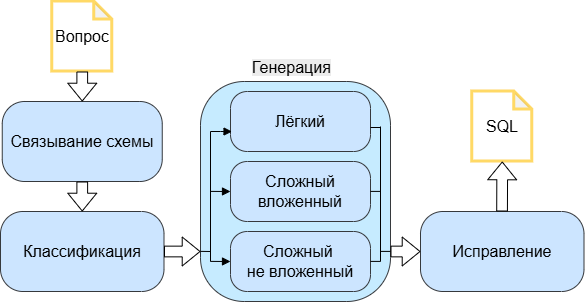
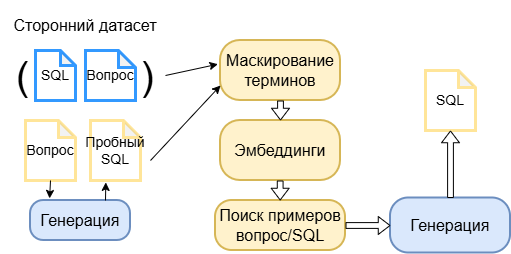
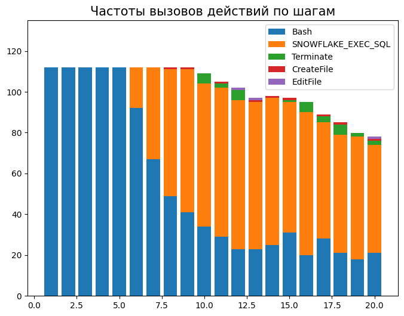

# Исследование методов text-to-SQL

- [Обзор архитектур современных методов](#обзор-архитектур-современных-методов)
- [Анализ методов text-to-SQL](#анализ-методов-text-to-sql)
  - [DIN-SQL](#din-sql)
  - [DAIL-SQL](#dail-sql)
  - [Spider Agent](#spider-agent)
- [Рекомендации по разработке](#рекомендации-по-разработке)
- [Источники](#источники)

За последние годы задача text-to-SQL получила значимое развитие благодаря использованию LLM и in-context learning техник, что позволило достичь большого прогресса на актуальных бенчмарках, таких как BIRD и Spider 2.0.

Данное исследование направлено на изучение существующих методологий и определения баланса между точностью и затратами в архитектурных решениях.

_Рисунок 1 - График изменения точности топ-1 метода на бенчмарках BIRD и Spider 2.0._

---

## Обзор архитектур современных методов

Современные архитектуры методов text-to-SQL разделяют на несколько модулей / техник.

_Таблица 1 - Основные модули и техники, используемые в архитектурах text-to-SQL систем_
| **Модуль**                         | **Описание**                                                                                                           | **Решаемые проблемы**                                                                     | **Ограничения**                                                                                                                                                       |
| ---------------------------------- | ---------------------------------------------------------------------------------------------------------------------- | ----------------------------------------------------------------------------------------- | --------------------------------------------------------------------------------------------------------------------------------------------------------------------- |
| Связывание схемы                   | Определение таблиц и столбцов, релевантных вопросу.                                                                    | Сложность базы данных, эффективность по стоимости.                                        | Вероятность не найти подходящие элементы.  Высокая вычислительная сложность для больших схем.  Необязателен для моделей с достаточным размером контекста. |
| Переписывание вопроса              | Переписывание исходного вопроса в более стандартизированную и понятную для модели форму.                               | Неоднозначность вопроса.                                                                  | Могут быть потеряны изначальные намерения пользователя, термины предметной области.                                                                                   |
| Извлечение содержимого базы данных | Извлечение значений столбцов, требуемых для определения условной фильтрации.                                           | Неоднозначность значений, «грязные данные».                                               | Может оказаться вычислительно затратно.                                                                                                                               |
| Внедрение внешних знаний           | Добавление описание предметной области, терминов, релевантных примеров пар вопрос/SQL.                                 | Неоднозначность вопроса, обобщение на разные области, эффективность SQL, надёжность.      | Описание предметной области может быть неполным или ошибочным.  Примеров генерации может не быть.                                                               |
| Декомпозиция                       | Разбиение задачи генерации или вопроса на несколько промежуточных с объединением результатов.                          | Неоднозначность вопроса, сложность базы данных, интерпретируемость.                       | Увеличение затрат.  Ошибка, допущенная в начале, может распространяться на дальнейшие шаги.                                                                     |
| Промежуточное представление        | Преобразование вопроса в структурированное представление, или создание скелета запроса перед генерацией итогового SQL. | Неоднозначность вопроса.                                                                  | Сложность обобщения на все архитектуры БД.                                                                                                                            |
| Исправление SQL                    | Выявление и исправление ошибок в коде запроса.                                                                         | Эффективность SQL, надёжность.                                                            | Значимо увеличивает затраты.                                                                                                                                          |
| Однородность вывода                | Генерация нескольких вариантов запроса и выбор наиболее подходящего.                                                   | Множество возможных SQL запросов, зависимость от схемы БД, эффективность SQL, надёжность. | Кратно большие затраты на генерацию нескольких запросов.                                                                                                              |

Большинство модулей в зависимости от автономности реализации можно разделить на три типа: традиционные (алгоритмические, без использования LLM), статичные (простые вызовы LLM) и агентные (модель сама выбирает следующее действие) – выбор одного из них является одним из самых важных по влиянию на стоимость и скорость работы системы. 

Было проведено сравнение архитектур. Используются следующие обозначения:

•	SL – связывание схемы (schema linking);

•	QR – переписывание вопроса (question rewriting);

•	DCR – извлечение содержимого БД (database content retrieval);

•	EK – внедрение внешних знаний (external knowledge);

•	D – декомпозиция (decomposition);

•	IR – промежуточное представление (intermediate representation);

•	Corr – исправление SQL (correction);

•	Cons – однородность вывода (consistency).

В качестве обозначений типа реализации используются:

•	T – традиционные;

•	S – статичные;

•	A – агентные.

_Таблица 2 - Сравнение архитектур современных методов text-to-SQL_
| **Метод**                      | **Предобработка** |        |         |        | **Трансляция** |        | **Постобработка** |          |
| ------------------------------ | ----------------- | ------ | ------- | ------ | -------------- | ------ | ----------------- | -------- |
|                                | **SL**            | **QR** | **DCR** | **EK** | **D**          | **IR** | **Corr**          | **Cons** |
| DIN-SQL [9]                    | S                 | -      | S       | T      | T              | T      | S                 | -        |
| DAIL-SQL [10]                  | -                 | -      | -       | T      | -              | -      | -                 | T        |
| MCS-SQL [11]                   | S                 | -      | T       | S + T  | -              | -      | -                 | S        |
| CHESS [12]                     | A                 | -      | T + A   | -      | -              | -      | A                 | A        |
| Distillery [13]                | -                 | S      | -       | -      | -              | -      | S                 | T        |
| CHASE-SQL [14]                 | T + S             | -      | T + S   | -      | S              | -      | S                 | S        |
| RSL-SQL [15]                   | T + S             | -      | T       | T + S  | S              | -      | S                 | S        |
| Spider Agent [8]               | A                 | -      | A       | -      | -              | -      | A                 | -        |
| ReFoRCE [16]                   | T + S             | -      | A       | -      | -              | -      | S                 | T        |
| LinkAlign [17]                 | S, A              | S, A   | -       | -      | T, A           | -      | -                 | -        |
| OpenSearch-SQL [18]            | T + S             | -      | T       | T + S  | -              | S      | A                 | T        |
| N-rep [19]                     | S                 | -      | -       | T      | -              | -      | -                 | T + S    |
| AskData [20]                   | T + S             | -      | T       | S      | -              | -      | T + S             | T        |
| AutoLink [21]                  | T + A             | -      | A       | -      | -              | -      | S                 | T + S    |
| DSR-SQL [22]                   | T + S             | S      | S       | T      | A              | -      | A                 | -        |
| APEX-SQL [23]                  | S                 | -      | A       | S      | T + S          | -      | A                 | S        |
| Rethinking Schema Linking [24] | S                 | -      | T       | -      | S              | -      | -                 | -        |
| MCI-SQL [25]                   | S                 | -      | T       | T + S  | -              | -      | S                 | T        |
| SchemaGraphSQL [26]            | T + S             | -      | -       | -      | -              | -      | -                 | -        |
| AV-SQL [27]                    | T + A             | S      | T       | -      | A              | -      | A                 | -        |
| AgentSM [28]                   | T + A             | -      | -       | T + S  | A              | -      | A                 | -        |

В столбце «Модели» перечислены LLM, использованные для оценки на бенчмарках Spider, BIRD и Spider 2.0 соответственно, если указана одна модель, она использовалась для всех отмеченных результатов. 

Для Spider и BIRD в скобках указывается метрика по dev датасету, вне скобок - по тестовому. 

Если метод оценена на датасете Spider 2.0-lite, результат помечается как l, если на Spider 2.0-snow, то как s. 

_Таблица 3 – Точность современных методов text-to-SQL_

| **Метод**                 | **Модели**                                  | **Spider, EX, %** | **BIRD, EX, %** | **Spider 2.0, EX, %** |
| ------------------------- | ------------------------------------------- | --------------------- | ------------------- | ------------------------ |
| DIN-SQL                   | GPT-4, GPT-4, GPT-4o                 | 85.30 (74.20)         | 55.90 (50.72)       | 1.46l                    |
| DAIL-SQL                  | GPT-4, GPT-4, GPT-4o                 | 86.20 (82.40)         | 57.41 (54.76)       | 5.68l                    |
| MCS-SQL                   | GPT-4                                       | 89.60 (89.50)         | 65.45 (63.36)       | -                        |
| CHESS                     | Gemini1.5-pro, Gemini1.5-pro, GPT-4o | 87.20                 | 71.10 (68.31)       | 3.84l 1.28s       |
| Distillery                | GPT-4o                                      | -                     | 71.83 (67.21)       | -                        |
| CHASE-SQL                 | Gemini 1.5 Pro                              | 87.60                 | 76.02 (74.90)       | -                        |
| RSL-SQL                   | GPT-4o, GPT-4o, o3                          | 87.90                 | 68.70 (67.21)       | 33.09l                   |
| Spider Agent              | Claude-Sonnet-4.5, Qwen3-Coder-Plus  | -                     | -                   | 41.86l 37.80s     |
| ReFoRCE                   | o3                                          | -                     | -                   | 55.21l 62.89s     |
| LinkAlign                 | GPT-4, GPT-4, DeepSeek-R1                   | - (91.20)      | - (61.6)     | 33.09l                   |
| OpenSearch-SQL            | GPT-4o                                      | 87.10                 | 72.28 (69.30)       | -                        |
| N-rep                     | Gemini 1.5 Flash                            | 87.00                 | - (69.25)    | -                        |
| AskData                   | GPT-4o                                      | -                     | 81.95 (77.64)       | -                        |
| AutoLink                  | DeepSeek-R1                                 | -                     | - (66.36)           | 52.28l 54.84s     |
| DSR-SQL                   | DeepSeek-V3.1, DeepSeek-R1           | -                     | - (68.32)    | 46.80l 63.80s     |
| APEX-SQL                  | DeepSeek-R1                                 | -                     | - (70.70)           | 73.13s                   |
| Rethinking Schema Linking | Gemini-2.0-flash                            | - (70.60)             | - (57.86)    | -                        |
| MCI-SQL                   | GPT-4o                                      | 88.7                  | 76.41 (74.45)       | -                        |
| SchemaGraphSQL            | Gemini-2.5-Flash                            | -                     | - (62.91)           | -                        |
| AV-SQL                    | Gemini-3-Pro                                | 85.59                 | - (72.16)           | 70.38s                   |
| AgentSM                   | Claude-4-Sonnet                             | -                     | -                   | 44.8l                    |

---

## Анализ методов text-to-SQL

Для оценки используется бенчмарк [Spider 2.0](https://github.com/xlang-ai/Spider2).

_* - данные только для 112 Snowflake примеров из Spider 2.0-lite._

### Статистика запусков на Spider 2.0-**lite**

_Таблица 4 - Результаты оценки методов text-to-SQL на датасете **Spider 2.0-lite**_

| **Метод**                         | **Модель**     | **EX, %** | **EX** **по исполнимым запросам,  %** | **Всего верных запросов** | **Всего исполнимых запросов** |
| --------------------------------- | -------------- | --------- | ------------------------------------------- | ------------------------- | ----------------------------- |
| DIN-SQL                           | Devstral 2     | 4.39      | 26.67                                       | 24                        | 90                            |
|                                   | Solar Pro 3    | 4.94      | 27.55                                       | 27                        | 98                            |
| DAIL-SQL                          | Devstral 2     | 7.86      | 31.85                                       | 43                        | 135                           |
|                                   | Solar Pro 3    | 7.31      | 30.46                                       | 40                        | 151                           |
| *Spider Agent                     | Devstral 2     | 3.47      | 16.96                                       | 19                        | 112                           |
| ReFoRCE w/o column exploration | Solar Pro 3    | 16.64     | 33.46                                       | 91                        | 272                           |
|                                   | Step 3.5 Flash | 36.56     | 49.38                                       | 200                       | 405                           |
| ReFoRCE                           | Step 3.5 Flash | 37.29     | 50.37                                       | 204                       | 405                           |
| AutoLink                          | Hy3 preview    | 40.77     | 54.93                                       | 223                       | 406                           |

_Таблица 5 - Статистика затрат оценки методов text-to-SQL на датасете **Spider 2.0-lite**_

| **Метод**                         | **Модель**     | **Время генерации,** **мин:сек** | **Вызовов LLM** | **Входных токенов на генерацию** | **Выходных токенов на генерацию** |
| --------------------------------- | -------------- | ----------------------------------- | --------------- | -------------------------------- | --------------------------------- |
| DIN-SQL                           | Devstral 2     | 00:06                               | 4               | 29,423                           | 1,253                             |
|                                   | Solar Pro 3    | 00:30                               | 3.17            | 33,838                           | 1,451                             |
| DAIL-SQL                          | Devstral 2     | 00:03                               | 1               | 30,769                           | 510                               |
|                                   | Solar Pro 3    | 00:05                               | 1               | 36,060                           | 602                               |
| *Spider Agent                     | Devstral 2     | 03:10                               | 18              | 164,205                          | 2,316                             |
| ReFoRCE w/o column exploration | Step 3.5 Flash | 07:00                               | 18              | 270,986                          | 8,035                             |
| ReFoRCE                           |                | 13:43                               | 31              | 527,439                          | 15,315                            |
| AutoLink                          | Hy3 preview    | 15:02                               | 7               | 125,578                          | 3,636                             |

### Статистика запусков на Spider 2.0-**snow**

_Таблица 6 - Результаты оценки методов text-to-SQL на датасете **Spider 2.0-snow**_

| **Метод**                         | **Модель**  | **EX, %** | **EX** **по исполнимым запросам,  %** | **Всего верных запросов** | **Всего исполнимых запросов** |
| --------------------------------- | ----------- | --------- | ------------------------------------------- | ------------------------- | ----------------------------- |
| DIN-SQL                           | Solar Pro 3 | 0.18      | 33.33                                       | 1                         | 3                             |
| DAIL-SQL                          |             | 0.37      | 15.39                                       | 2                         | 13                            |
| ReFoRCE w/o column exploration |             | 22.85     | 36.77                                       | 125                       | 340                           |
| ReFoRCE                           |             | 23.58     | 37.39                                       | 129                       | 345                           |

_Таблица 7 - Статистика затрат оценки методов text-to-SQL на датасете **Spider 2.0-snow**_

| **Метод**                         | **Модель**  | **Время генерации,**  **мин:сек** | **Вызовов LLM** | **Входных токенов на генерацию** | **Выходных токенов на генерацию** |
| --------------------------------- | ----------- | --------------------------------------- | --------------- | -------------------------------- | --------------------------------- |
| DIN-SQL                           | Solar Pro 3 | 00:26                                   | 4               | 36,857                           | -                                 |
| DAIL-SQL                          |             | 00:05                                   | 1               | 36,060                           | 602                               |
| ReFoRCE w/o column exploration |             | 16:00                                   | 33              | 498,086                          | 29,093                            |
| ReFoRCE                           |             | 36:13                                   | 52              | 932,074                          | 42,855                            |

---

### DIN-SQL

[**DIN-SQL**](data/Spider2/spider2-lite/baselines/dinsql) был одним из самых точных на бенчмарке Spider [9]. Алгоритм:
1. Связывание схемы через LLM.
2. Классификация промпта по сложности и выбор промпта генерации.
3. Генерация SQL.
4. Отладка сгенерированного SQL.

_Рисунок 2 - Схема метода DIN-SQL_

---

### DAIL-SQL

[**DAIL-SQL**](data/Spider2/spider2-lite/baselines/dailsql) также как и предыдущий метод был одним из лучших на бенчмарке Spider [10]. Алгоритм:
1. Маскирование всех вопросов из тестового и обучающего датасетов;
2. Вычисление эмбеддингов вопросов и SQL из обучающего датасета;
3. Генерация пробного SQL запроса s';  
4. Векторный поиск наиболее релевантных пар вопрос/SQL из обучающего датасета и их добавление в промпт;
5. Формирование промпта из найденных примеров генерации и схемы БД, представленной в виде синтаксиса, похожего на DDL (code representation);
6. Генерация итогового SQL.

Так как примеров генерации для Spider 2.0 нет, в методе используется только шаг 6, т. е. одношаговая генерация.

_Рисунок 3 - Схема метода DAIL-SQL_

---

### Spider Agent

[**Spider Agent**](data/Spider2/methods/spider-agent-lite) является базовым методом для бенчмарка Spider 2.0 [9]. 

Представляет из себя ReAct агента со следующими инструментами:

**Bash** – выполнение команды в консоли;

**CreateFile** – создание файла;

**EditFile** – редактирование файла;

**EXEC_SQL** – исполнение SQL запроса;

**GetTables** – поиск имён всех таблиц БД;

**GetTabInfo** – получение информации о столбцах таблицы;

**SampleRows** – извлечение примеров строк таблиц;

**FAIL** – агент решает, что задача невыполнима;

**Terminate** – агент решает, что задача завершена.

#### Статистика запуска

* Данные только для 112 Snowflake примеров из Spider 2.0-lite.

_Таблица 4 - Число вызовов каждого действия Spider Agent_
| **Действие**       | **Суммарное количество** |
| ------------------ | ------------------------ |
| BASH               | 1082                     |
| SNOWFLAKE_EXEC_SQL | 919                      |
| Terminate          | 30                       |
| CreateFile         | 9                        |
| EditFile           | 3                        |

_Рисунок 4 - Частоты вызовов действий методом Spider Agent_

---

### ReFoRCE

---

## Рекомендации по разработке 

_Таблица n - Рекомендации по разработке text-to-SQL систем_

| **Модуль**                         | **Тип реализации** | **Лучшие практики**                                                                           | **Влияние**                                                                                                                                  | **Источник**                                                                      |
| ---------------------------------- | ------------------ | --------------------------------------------------------------------------------------------- | -------------------------------------------------------------------------------------------------------------------------------------------- | --------------------------------------------------------------------------------- |
| Связывание схемы                   | Традиционная       | Генерация эмбеддингов описаний схемы и векторный поиск.                                       | Генерация: +11.71 секунд (векторный поиск). Предобработка: +338 секунд (генерация эмбеддингов).                                     | Таб. 18, на Spider 2.0-lite.                                                   |
|                                    |                    | Сжатие схемы по паттернам.                                                                    | До 96% сокращение описания схемы.                                                                                                            | \[16, с. 3-5\], на Spider 2.0-lite.                                            |
|                                    | Статичная          | Двунаправленное связывание схемы.                                                             | +5.41% EX. Генерация: +2.6 секунды; +10500 токенов.                                                                                 | \[24, с. 4522\], для GPT-4o-mini на BIRD dev.                               |
|                                    |                    | На основе SQL.                                                                                | 90.48% SRR; 95.54% Recall. Генерация: +5310 токенов.                                                                                | \[15, с. 8\], для GPT-4o на BIRD dev.                                       |
|                                    |                    | Графовое представление.                                                                       | +6.38% EX; 95.71% Recall.                                                                                                                 | \[26, с. 2590\], для GPT-5-mini на BIRD dev.                                |
|                                    | Агентная           | Агент с доступом к векторной базе данных.                                                     | Генерация: +11.71 секунд (векторный поиск); +871 секунд; +162747 токенов. Предобработка: +338 секунд (генерация эмбеддингов). | Таб. 18, для Hy 3 preview на Spider 2.0-lite.                               |
| Переписывание вопроса              | Статичная          | Вопрос дополняется информацией из внешних знаний, выделяются заданные ограничения.            | +7.7% EX. Генерация: +3.25 секунд; +1683 токенов.                                                                                   | \[27, с. 11\], для Gemini-3-Pro       на Spider 2.0-snow.                      |
|                                    | Агентная           | Агент переписывает и уточняет вопрос из результатов связывания схемы.                         | +17.1% EM; +7.7% Recall (связывание схемы). Генерация: +30.9 секунд.                                                             | \[17, с. 984\], для DeepSeek-R1 на Spider.                                  |
| Извлечение содержимого базы данных | Традиционная       | Хэш индексы уникальных значений.                                                              | +2.92% EX. Генерация: +5 секунд.                                                                                                       | \[14, с. 11\], \[12, с. 14\] для Gemini 1.5 на BIRD dev.                    |
|                                    | Статичная          | Автоматическое профилирование данных.                                                         | +2.80% EX. Предобработка: +3700 секунд; +22000 токенов (выходных).                                                                  | \[25, с. 9\], для GPT-4o на BIRD dev.                                       |
|                                    |                    | Генерация исследовательских запросов.                                                         | + 0.73% EX. Генерация: +111 секунд; +554 секунды (исправление); +959818 токенов.                                                 | Таб. 15, 4.4, c. 84, для Step 3.5 Flash на Spider 2.0-lite.                    |
|                                    | Агентная           | Использование генерации исследовательских запросов как инструмент агента.                     | +2.4% SRR (связывание схемы). Генерация: +112 секунд.                                                                                  | \[21, с. 6\], рис. 25, для DeepSeek-R1, Hy 3 preview на Spider 2.0-lite.    |
| Внедрение внешних знаний           | Традиционная       | Маскирование вопросов, генерация эмбеддингов, векторный поиск релевантных примеров генерации. | +10.1% EX. Генерация: 600 токенов.                                                                                                     | \[10, с. 8\], для GPT-4 на Spider dev.                                      |
|                                    | Статичная          | Генерация рассуждений для примеров вопрос/SQL.                                                | +1.4% EX.                                                                                                                                    | \[18, с. 18\], для GPT-4o на BIRD dev.                                      |
| Декомпозиция                       | Статичная          | Декомпозиция вопроса и объединение промежуточных SQL.                                         | +1.24% EX.                                                                                                                                   | \[14, с. 11\], для Gemini 1.5 на BIRD dev.                                  |
|                                    | Агентная           | Агент планировщик.                                                                            | +5.39% EX. Генерация: +6.50 секунд; +5428 токенов.                                                                                  | \[27, с. 11-12\], для Gemini-3-Pro на Spider 2.0-snow.                      |
|                                    |                    | Разделение схемы на части, вызов агента для каждой, объединение.                              | +7.13% EX. Генерация: +46.28 секунд; +71024 токенов.                                                                                | \[27, с. 11-12\], для Gemini-3-Pro на Spider 2.0-snow.                      |
| Исправление                        | Статичная          | Исправление на основе результата исполнения.                                                  | +7.87% EX. Генерация: +262 секунд; +14700 токенов.                                                                                  | \[21, с. 17\], таб. 18, для DeepSeek-R1, Step 3.5 Flash на Spider 2,0-lite. |
|                                    |                    | Добавление вручную составленных правил и семантическое исправление.                           | +0.98 EX. Генерация: +8 секунд; +700 токенов (выходных).                                                                            | \[25, с. 9\], для GPT-4o на BIRD dev.                                       |
|                                    | Агентная           | Исправление агентом и проверка на семантическую корректность и согласованность с вопросом.    | +5.3% EX. Генерация: +6440 токенов; +13.17 секунд.                                                                                  | \[27, с. 11-12\],  для Gemini 3 Pro на Spider 2.0-snow.                     |
| Однородность вывода                | Традиционная       | Группировка запросов по результатам исполнения.                                               | +0.7% EX.                                                                                                                                    | [11, с. 344], для GPT-4 на BIRD dev.                                        |
|                                    | Статичная          | Голосование по большинству и попарное сравнение через LLM.                                    | Генерация: +60 секунд; +8623 токенов.                                                                                                  | Таб. 18, для Step 3.5 Flash на Spider 2.0-lite.                             |

## Источники

#### Систематические обзоры

1. [A Survey of Text-to-SQL in the Era of LLMs: Where are we, and where are we going?](https://arxiv.org/abs/2408.05109v6)

2. [Next-Generation Database Interfaces: A Survey of LLM-based Text-to-SQL](https://arxiv.org/abs/2406.08426v8)

3. [Toward Real-World Table Agents: Capabilities, Workflows, and Design Principles for LLM-based Table Intelligence](https://arxiv.org/abs/2507.10281)

4. [A Survey on Employing Large Language Models for Text-to-SQL Tasks](https://arxiv.org/abs/2407.15186)

5. [Exploring the Landscape of Text-to-SQL with Large Language Models: Progresses, Challenges and Opportunities](https://arxiv.org/abs/2505.23838)

6. [DIN-SQL: Decomposed In-Context Learning of Text-to-SQL with Self-Correction](https://arxiv.org/abs/2304.11015)

#### Бенчмарки

7. [Can LLM Already Serve as A Database Interface? A BIg Bench for Large-Scale Database Grounded Text-to-SQLs](https://arxiv.org/abs/2305.03111)

8. [SPIDER 2.0: EVALUATING LANGUAGE MODELS ON REAL-WORLD ENTERPRISE TEXT-TO-SQL WORKFLOWS](https://arxiv.org/abs/2411.07763)

#### Методы

9. [DIN-SQL: Decomposed In-Context Learning of Text-to-SQL with Self-Correction](https://arxiv.org/abs/2304.11015)

10. [Text-to-SQL Empowered by Large Language Models: A Benchmark Evaluation](https://arxiv.org/abs/2308.15363)

11. [MCS-SQL: Leveraging Multiple Prompts and Multiple-Choice Selection For Text-to-SQL Generation](https://aclanthology.org/2025.coling-main.24.pdf)

12. [CHESS: Contextual Harnessing for Efficient SQL Synthesis](https://arxiv.org/abs/2405.16755)

13. [The Death of Schema Linking? Text-to-SQL in the Age of Well-Reasoned Language Models](https://arxiv.org/abs/2408.07702)

14. [CHASE-SQL: Multi-Path Reasoning and Preference Optimized Candidate Selection in Text-to-SQL](https://arxiv.org/abs/2410.01943)

15. [RSL-SQL: Robust Schema Linking in Text-to-SQL Generation](https://arxiv.org/abs/2411.00073)

16. [ReFoRCE: A Text-to-SQL Agent with Self-Refinement, Consensus Enforcement, and Column Exploration](https://arxiv.org/abs/2502.00675)

17. [LinkAlign: Scalable Schema Linking for Real-World Large-ScaleMulti-Database Text-to-SQL](https://aclanthology.org/2025.emnlp-main.51.pdf)

18. [OpenSearch-SQL: Enhancing Text-to-SQL with Dynamic Few-shot and Consistency Alignment](https://dl.acm.org/doi/pdf/10.1145/3725331)

19. [Cheaper, Better, Faster, Stronger: Robust Text-to-SQL without Chain-of-Thought or Fine-Tuning](https://arxiv.org/abs/2505.14174)

20. [Automatic Metadata Extraction for Text-to-SQL](https://arxiv.org/abs/2505.19988)

21. [AutoLink: Autonomous Schema Exploration and Expansion for Scalable Schema Linking in Text-to-SQL at Scale](https://arxiv.org/abs/2511.17190)

22. [Text-to-SQL as Dual-State Reasoning: Integrating Adaptive Context and Progressive Generation](https://arxiv.org/abs/2511.21402)

23. [APEX-SQL: Talking to the data via Agentic Exploration for Text-to-SQL](https://arxiv.org/abs/2602.16720)

24. [Rethinking Schema Linking: A Context-Aware Bidirectional Retrieval Approach for Text-to-SQL](https://aclanthology.org/2026.findings-eacl.236.pdf)

25. [MCI-SQL: Text-to-SQL with Metadata-Complete Context and Intermediate Correction](https://arxiv.org/abs/2603.13390)

26. [SchemaGraphSQL: Efficient Schema Linking with Pathfinding Graph Algorithms for Text-to-SQL on Large-Scale Databases](https://aclanthology.org/2026.findings-eacl.134.pdf)

27. [AV-SQL: Decomposing Complex Text-to-SQL Queries with Agentic Views](https://arxiv.org/abs/2604.07041)

28. [AgentSM: Semantic Memory for Agentic Text-to-SQL](https://arxiv.org/abs/2601.15709)
